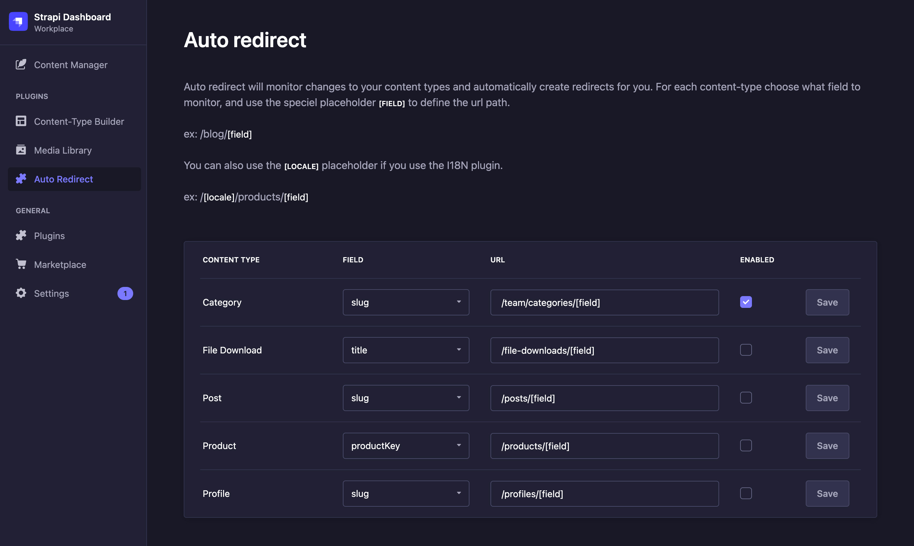
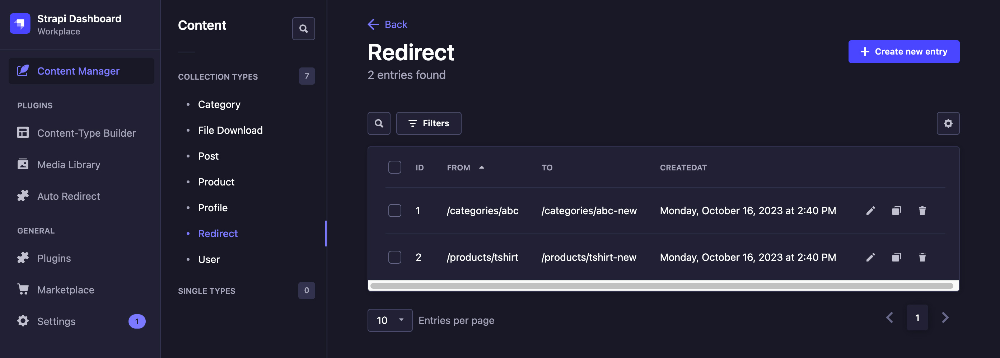

# Strapi Auto Redirect

Auto redirect will monitor changes to your content types and automatically create redirects for you. For each content type, choose which field to monitor (e.g., a **slug** field). Whenever this value changes, the system will automatically create a mapping from the old URL to the new one. This mapping can be imported to your frontend to handle the redirect.

## Installation

Using NPM
```npm install --save strapi-plugin-auto-redirect```

Using Yarn
```yarn add strapi-plugin-auto-redirect```

## Setup

Enable the plugin by adding the following snippet to `./config/plugins.js` 

```
module.exports = ({ env }) => ({
  "auto-redirect": {
    enabled: true
  }
});
```

## Usage
In your admin dashboard, use the new **Auto Redirect** menu in the sidebar to determine which content types and fields should be monitored.




### Placeholders
Specify the URL path for each content-type and use the `[field]` placeholder which will contain the value of the selected field. 


#### I18N 
If you're using the I18N plugin and the locale is part of your URL structure, the `[locale]` placeholder is available.


### Redirect content type
All redirects are stored in a custom content type named **Redirect**. From here, you can easily remove, add, or edit entries just like any other Strapi content.



Whenever you modify the URL structure or the selected field, the system will automatically generate all the necessary redirects from the old URLs to the new ones. 
We also ensure that whenever a new URL is created, all previous redirects pointing to it are removed.

### Fetch redirects via API
You can fetch the generated redirect routes at the `/api/auto-redirect` endpoint of your Strapi host.

```
fetch(`http://cms.example.com/api/auto-redirect`)
```

